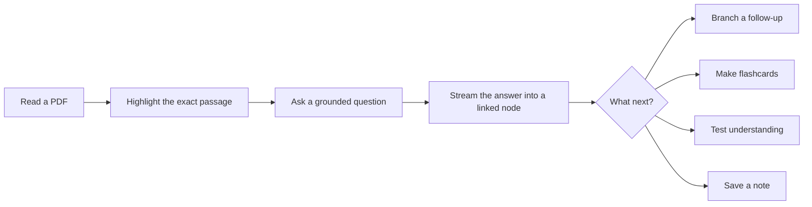
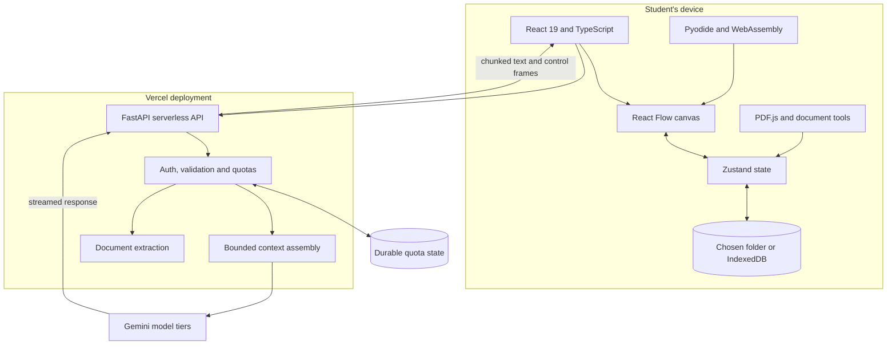

# StudyCanvas

### Study on an infinite canvas

Turn a difficult passage into a visible trail of questions, answers, tests and notes, without losing sight of the source.

[**Open the live product**](https://studycanvas.app) · [**Read the architecture**](docs/ARCHITECTURE.md) · [**See the engineering decisions**](docs/DECISIONS.md) · [**Follow the build journey**](docs/ENGINEERING-JOURNEY.md)

> This is the public engineering record for StudyCanvas. The production source remains private while the product is under active development. This repository documents what I built, why I built it this way, what went wrong, and how I tested it. It does not publish production code, prompts, credentials or private user data.

## The short version

I built StudyCanvas because normal AI chat loses the structure of learning. A useful answer might come from one line of a PDF, lead to three follow-up questions, become a flashcard, and later turn into a mock-exam topic. In a chat transcript, all of that collapses into one scrolling column.

StudyCanvas keeps the source and the reasoning on the same infinite canvas:

The result is not a chatbot placed beside a PDF. It is a workspace where the document, questions, reasoning, revision tools, handwritten work and executable code can live together.

## Product proof

These are captures from the real product, not concept mock-ups.

| Ground a question in the exact selection | Sit a generated practice paper |
|---|---|
|  |  |
| The selected quote, page context and question travel together. The streamed answer stays linked to its source. | Exam Forecast turns historical papers and optional supporting material into a fresh practice paper with timing, marks and working space. |

| Run Python beside the explanation | Keep the whole learning trail visible |
|---|---|
|  |  |
| Code nodes run CPython in the browser through Pyodide and WebAssembly. The server never executes the student's snippet. | PDFs, answer branches, quizzes, cards, zones and notes remain spatially connected rather than disappearing into chat history. |

[Watch the real highlight-to-answer interaction](assets/product/highlight-to-answer.mp4) in a short product capture, or try the interactive version at [studycanvas.app](https://studycanvas.app).

## Project snapshot

Measured from the private production repository at revision `f5065d6` on 6 September 2026:

| Measure | Current snapshot |
|---|---:|
| Development history | 398 commits since 21 February 2026 |
| Implementation size | 103,565 source lines across 434 source files |
| Canvas vocabulary | 21 registered node types |
| API surface | 22 capability route modules behind one FastAPI app |
| Focused frontend regressions | 46 scripts passing |
| Focused backend regressions | 9 scripts passing |
| Delivery | React application and Python API deployed together on Vercel |

These numbers describe engineering scope, not product quality. The [quality report](docs/QUALITY.md) separates automated evidence from behaviour that still needs a browser or real model call.

## What is technically interesting

### 1. Streaming into a graph, not a transcript

Each answer is a live graph node. Incoming chunks update that node in place while control frames can create sibling quiz, flashcard, image or source nodes. Every in-flight request owns an `AbortController`, so closing a node or navigating away cancels the work and settles partial content into a readable state.

### 2. Grounding that is visible to the student

A turn is built from bounded, labelled pieces: the exact selection, surrounding page text, the direct parent answer, recent history, explicit node mentions, workspace memory and optional visuals. I chose this over a hidden vector index because single-document study benefits from exact, inspectable context. The trade-off is that StudyCanvas is not designed for semantic search across a large document corpus.

### 3. Two local-first storage engines

On Chromium desktop, a workspace can be a real folder chosen by the user. On browsers without the File System Access API, the same logical workspace is stored in IndexedDB. Both modes cover canvas state, source documents, thumbnails, audio, versions, memories and exam sessions. ZIP export provides a portable escape hatch.

### 4. Serverless constraints treated as design inputs

The deployment has tight request-body, execution-time and bundle-size limits. Large document uploads can therefore fall back to browser-side PDF.js extraction. Multimodal requests share a byte budget and compress images through progressively smaller quality steps. Native and pure-Python extraction paths emit one page-structured contract so the frontend does not care which path ran.

### 5. Cost controls that survive cold starts

Per-instance counters are not enough on serverless infrastructure. Paid model paths use durable quota state, per-user caps, a project-wide ceiling and feature kill switches. Expensive endpoints retain a limited in-memory safety floor when durable storage is unavailable. Public demo questions use server-owned passages so visitors cannot turn the demo into a general-purpose model proxy.

### 6. Browser-native tools where the boundary matters

Python runs locally through Pyodide. PDF rendering and large-file text extraction use PDF.js. Handwriting uses a one-euro filter and incremental scratch-layer rendering to reduce jitter without making fast strokes trail the pen. Voice sessions use short-lived server-minted tokens rather than exposing the provider key to the browser.

## Architecture at a glance

The browser owns the workspace and the interaction model. The API is stateless with respect to user documents: it validates a request, assembles only the context required for that action, calls the appropriate model tier and streams the result back. Uploaded files may be processed temporarily for extraction and are deleted after that request. There is no server-side document library and no vector database.

Read the [full architecture report](docs/ARCHITECTURE.md) for the request flows, storage model, document pipeline, Exam Forecast design, deployment boundaries and failure handling.

## Key decisions and trade-offs

| Decision | Why I chose it | Cost accepted |
|---|---|---|
| Direct scoped context instead of vector RAG | Exact selections are easy to inspect and strong enough for a focused document session | No corpus-wide semantic retrieval |
| Local-first persistence instead of a document database | Smaller privacy surface, lower hosting cost and user-owned files | Browser-dependent durability and no real-time collaboration |
| Static model tiers instead of a learned router | Predictable cost and fewer silent misroutes | Less per-query optimisation |
| Fetch streams with in-band control frames | Works through the existing serverless HTTP path and supports incremental side artefacts | More client parser state than plain JSON |
| Pyodide instead of remote code execution | Real Python output without running untrusted code on my servers | A larger browser runtime and a cold-start download |
| Dual extraction behind one page contract | Native quality locally and deployable pure-Python extraction in production | Two implementations must stay behaviourally aligned |

The [decision record](docs/DECISIONS.md) explains the alternatives, consequences and conditions that would make me revisit each choice.

## Engineering journey

StudyCanvas began as a weekend PDF and quiz prototype. The architecture changed as real constraints appeared:

| Period | What changed |
|---|---|
| February 2026 | First canvas, grounded questions, quizzes, flashcards, OCR, local files and handwriting |
| March 2026 | Voice notes, browser Python, code assistance, calculator, organisation and multi-page study tools |
| April to June 2026 | Live voice, user memory, notes, multi-PDF canvases, version history, zones and richer exports |
| July 2026 | Spaced repetition, widgets, security hardening and the first Exam Forecast workflow |
| August 2026 | Full PDF lifecycle work, selection tools, production review, regression gates and performance passes |
| September 2026 | Source-grounded Exam Forecast modes, streamed marking, real product captures and the public engineering report |

The detailed [engineering journey](docs/ENGINEERING-JOURNEY.md) connects each milestone to the problem that forced the next architectural step. This is more useful than a feature changelog because it includes failed approaches and course corrections.

## Documentation map

| Document | What it answers |
|---|---|
| [Architecture](docs/ARCHITECTURE.md) | How do the browser, API, models, storage and document paths fit together? |
| [Decisions](docs/DECISIONS.md) | Why were the major technical choices made, and what did they cost? |
| [Engineering journey](docs/ENGINEERING-JOURNEY.md) | How did a two-day prototype become the current system? |
| [Product walkthrough](docs/PRODUCT-WALKTHROUGH.md) | What does a real study session look like from upload to revision? |
| [Quality report](docs/QUALITY.md) | What is tested, what was measured, and what remains manual? |
| [Privacy and security](docs/PRIVACY-AND-SECURITY.md) | What leaves the device, what is stored, and how are paid endpoints protected? |
| [Contributing](CONTRIBUTING.md) | How can someone report a documentation issue or suggest an improvement? |
| [Security policy](SECURITY.md) | How should a vulnerability be reported responsibly? |

## Honest limits

- StudyCanvas is a solo-built product, not a mature multi-team platform.
- There is no native mobile app and the infinite canvas is better on a larger screen.
- There is no real-time collaboration yet.
- Clearing site data can remove an IndexedDB workspace if it was not exported. Folder mode is safer because the files remain on disk.
- AI answers and marking can be wrong. Grounding and source visibility make checking easier; they do not guarantee correctness.
- Exam Forecast is a source-grounded practice-paper generator, not a prediction guarantee. I have not published an accuracy benchmark for future-question prediction.
- The production source is private, so readers cannot independently reproduce every implementation claim from this repository. Claims here are tied to dated source audits and deliberately avoid unsupported performance figures.

## Technology

**Frontend:** React 19, TypeScript, Vite, React Flow, Zustand, Tailwind CSS, PDF.js, Pyodide, CodeMirror, TipTap and KaTeX

**Backend:** Python 3.12, FastAPI, Pydantic, streamed HTTP responses and serverless functions

**AI and media:** Gemini model tiers, vision and OCR, live voice, transcription, image generation and optional web grounding

**Platform:** Vercel, durable KV-backed quotas, Vercel Analytics and Speed Insights

## About this repository

This repository is intentionally documentation-first. There is no fake starter application and no reduced source snapshot that would misrepresent the production system. The useful artefact is the engineering reasoning: system boundaries, data flows, trade-offs, failures, verification and the real product captures that support the story.

No licence is currently granted for reuse of the documentation or media. Standard copyright therefore applies. The product source has its own private repository and is not covered by this public report.

## Builder

I am **Akshay Reddy Gujjula**, a UCL Computer Science student. I designed, built and deployed StudyCanvas as a solo project while using it for my own revision.

[Live product](https://studycanvas.app) · [Engineering page](https://studycanvas.app/engineering) · [GitHub](https://github.com/AkshayReddyGujjula) · [LinkedIn](https://www.linkedin.com/in/akshay-reddy-gujjula-aa79a92a7/)

If you are reviewing this for an internship, start with the [product walkthrough](docs/PRODUCT-WALKTHROUGH.md), then read the [decision record](docs/DECISIONS.md). Those two documents show the product and the engineering judgement behind it fastest.
