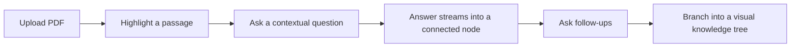
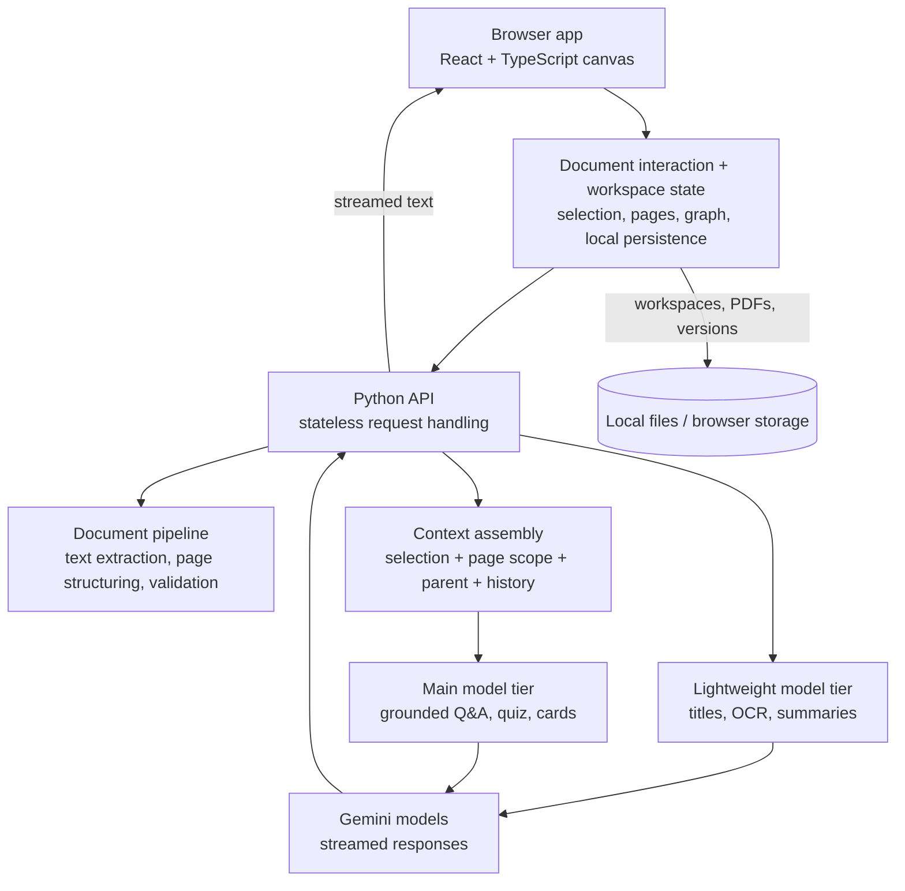

# StudyCanvas

Study on an infinite canvas: highlight a passage in a PDF, ask a question about it, and the streamed answer becomes a connected node you can branch follow-ups from.

**Live product:** https://studycanvas.app

> Showcase repository. The production StudyCanvas codebase is private while the product is under active commercial development. This repo documents the product, the architecture, and selected engineering decisions. No production source is published here.

## How it works

Upload a PDF onto the canvas. Select text in the document (or inside an existing answer), ask a question, and the response streams into a new node linked to its source as it arrives. Select text inside that answer to branch again. Over a study session the canvas becomes a tree of questions, answers, quizzes, and flashcards grounded in the document.

The fastest way to understand it is the live site: https://studycanvas.app

## What makes it different from ChatGPT + PDF

A chatbot gives you a linear transcript. StudyCanvas keeps the *source* and the *reasoning* on screen together:

- **Spatial, not linear.** Every answer is a draggable node with an edge back to the passage or node it came from. Parallel lines of enquiry sit side by side instead of scrolling away.
- **Source-grounded by construction.** Each question carries the exact highlighted passage, the surrounding page content, and (for follow-ups) the direct parent answer. Answers render with their source quote visible.
- **Branching is the default.** Follow-ups can continue inside a node as a thread *or* split off as child nodes, so one difficult paragraph can grow into its own subtree. Subtrees can be collapsed, and the tree can be exported into study notes.
- **Answers can emit study artefacts.** Responses can produce quiz questions, flashcard stacks, summaries, and generated visuals as their own nodes rather than formatted text in a chat log.
- **Documents stay local at rest.** Workspaces persist to a user-chosen local folder (Chromium) or browser storage, not a server-side document store. Content is sent to the AI service only when an AI feature is invoked — there is no end-to-end encryption, and that boundary is worth stating plainly.

What this is *not*: vector RAG. There is no embedding index or vector search over the document. Context is scoped page content and explicit selections passed directly to the model. That is a deliberate trade-off — exact, auditable grounding for single-document study rather than retrieval over a corpus.

## Architecture

How to read it:

- The **browser app** (React 19, TypeScript, XYFlow canvas, Zustand stores) owns the document view, the graph, selection handling, streaming UI state, and workspace persistence.
- The **Python API** (FastAPI, serverless) is stateless with respect to user documents: each request resends the document scope, selection, and history it needs. The server holds no user documents between requests (quota and rate-limit state excepted).
- The **document pipeline** extracts text/Markdown per page behind the same per-page contract in both production and local paths, so the frontend can split and scope context by page.
- **Context assembly** builds a bounded prompt from the highlight, the current page scope, the direct parent answer, recent history, and optional visuals (page render, whiteboard screenshot, attachments).
- **Model tiers** assign cheap, low-risk work (titles, transcription, short summaries) to a lightweight tier and grounded Q&A to the main tier, with automatic fallback on transient model errors. There is no per-query "complexity classifier" — this corrects an older description of the project that mentioned one.
- **Streaming** is chunked plain text with in-band markers the client demultiplexes into display text, usage data, and side-nodes (quiz/flashcards/images).
- **Persistence** is local-first: a real folder on disk where supported, browser storage elsewhere, plus portable ZIP export/import.

Deliberately omitted from this diagram: endpoint names, request schemas, prompt contents, model-selection internals, quotas, rate limits, and infrastructure sizing.

## Engineering highlights

### 1. Streamed LLM output inside draggable graph nodes

**Problem.** Token streams assume a single linear transcript. Here every in-flight answer lives inside a movable, collapsible, page-scoped graph node, and one turn can also spawn sibling nodes (quiz, flashcards, images).

**Design.** The backend streams chunked text with in-band markers; the client demultiplexes display text from control frames, patches per-node streaming state on each chunk, and tracks an abort controller per request. Interrupted streams settle into readable partial content instead of hanging spinners, and page navigation aborts stale requests.

**Result.** Cancellation, retries, and navigation during generation behave predictably, and multi-artefact turns land as separate nodes without corrupting the answer text.

### 2. Branching context that stays auditable

**Problem.** Unbounded conversation history is expensive and makes answers hard to trace back to the source.

**Design.** Each turn sends the exact selection, the surrounding page scope, the *direct* parent answer only (not full ancestry), a bounded recent history with a rolling summary for long threads, and explicitly tagged node references. Visual context (page render, ink screenshot, attachments) is attached only when relevant — for example, the whiteboard snapshot is sent only when handwriting is present on the page.

**Result.** Follow-ups stay grounded in what the student actually selected, token spend stays bounded, and any answer can be traced to its quote and parent in one step.

### 3. Tiered model use without a complexity router

**Problem.** Running every task — titles, OCR, summaries, full grounded answers — on the same model tier wastes money and latency budget.

**Design.** Tasks are assigned statically by cost/risk: lightweight work goes to a smaller tier, grounded Q&A and artefact generation to the main tier, with an opt-in larger model for the custom-assistant node and automatic retry on a higher tier for transient failures. Output caps and context budgets bound worst-case cost per call.

**Result.** Lower spend on high-volume trivial calls without adding a classifier that could misroute real questions. (A previously stated ~40% token-saving figure is not traceable to a benchmark in the codebase, so it is intentionally not repeated here — see Results.)

### 4. Local-first workspaces with a real folder on disk

**Problem.** Students work with large PDFs across sessions and browsers; server-side document storage would create hosting cost, privacy surface, and lock-in.

**Design.** Where the File System Access API is available, the workspace *is* a user-visible folder (state, PDFs, thumbnails, audio, versions, memory files). Elsewhere the same logical schema lives in IndexedDB, with a fast-restore cache and crash-recovery store. Large uploads that exceed serverless body limits are extracted client-side and sent as structured text through the same cleaning path.

**Result.** Work survives reloads and browser wipes differently by backend (folder vs. same-origin storage — stated honestly in-app), PDFs never need a server round-trip after upload except when AI features are invoked, and whole workspaces move as ZIP files.

### 5. Serverless-aware document ingestion

**Problem.** High-quality PDF-to-Markdown tooling is native and heavy; serverless functions are size- and time-limited.

**Design.** Production extraction uses a pure-Python path that fits the function bundle; a higher-fidelity native path is used locally behind the same page-delimited contract. Both emit identical per-page structure, with ligature/encoding repair, graceful handling of encrypted, empty, and image-only PDFs, and Office-to-PDF conversion feeding the same pipeline.

**Result.** One frontend contract for paging, highlighting, and scoping regardless of where extraction ran, and clean 4xx errors for unreadable files instead of 500s.

## Results and usage

| Metric | Result | Source |
|---|:---:|---|
| Deployment | Live production web app | Verified: hosted app + API on Vercel, reachable at studycanvas.app |
| Response streaming | Streams progressively (chunked) with cancel | Verified in implementation (client + server) |
| Highlight-grounded Q&A | Selection + page scope + parent sent per turn | Verified in implementation |
| Branching knowledge tree | Follow-ups branch as linked nodes/threads | Verified in implementation |
| Handwriting / whiteboard understanding | Vision path handles handwritten and sketched input | Implementation verified; recognition accuracy not benchmarked |
| Local persistence | Local folder where supported, browser storage fallback | Verified; folder mode is Chromium-only |
| Weekly active users | ~10, including tutored students | Owner-reported; not verifiable from source alone |

Notes on honesty: user counts come from product analytics outside this repo. The handwriting path exists and is wired end to end, but no accuracy benchmark ships with the code. An older claim of ~40% token reduction from model routing is not repeated here because no benchmark or measurement for it was found in the implementation, and current routing is static per task rather than per-query complexity.

## Tech stack

**Frontend:** React 19, TypeScript, XYFlow (React Flow), Zustand, Tailwind, PDF.js, Vite

**Backend:** Python, FastAPI, Pydantic, server-side streaming, invite-gated sessions, per-user quotas and rate limits

**AI / documents:** Gemini models (tiered by task), vision/OCR path for snippets and handwriting, transcription path for voice notes, page-structured PDF extraction with a higher-fidelity local path

**Infrastructure:** Single-domain app + API hosting with serverless functions, analytics and insights, embedded media (video/graphing) via allow-listed providers

## Why the source is private

The production StudyCanvas codebase is private while the product is under active commercial development. This repository documents the product, architecture, engineering decisions, and selected technical results.

## Creator / contact

**Akshay Reddy Gujjula** — Computer Science student at UCL

- Live: https://studycanvas.app
- GitHub: https://github.com/AkshayReddyGujjula
- LinkedIn: https://www.linkedin.com/in/akshay-reddy-gujjula-aa79a92a7/
