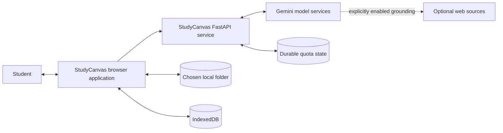
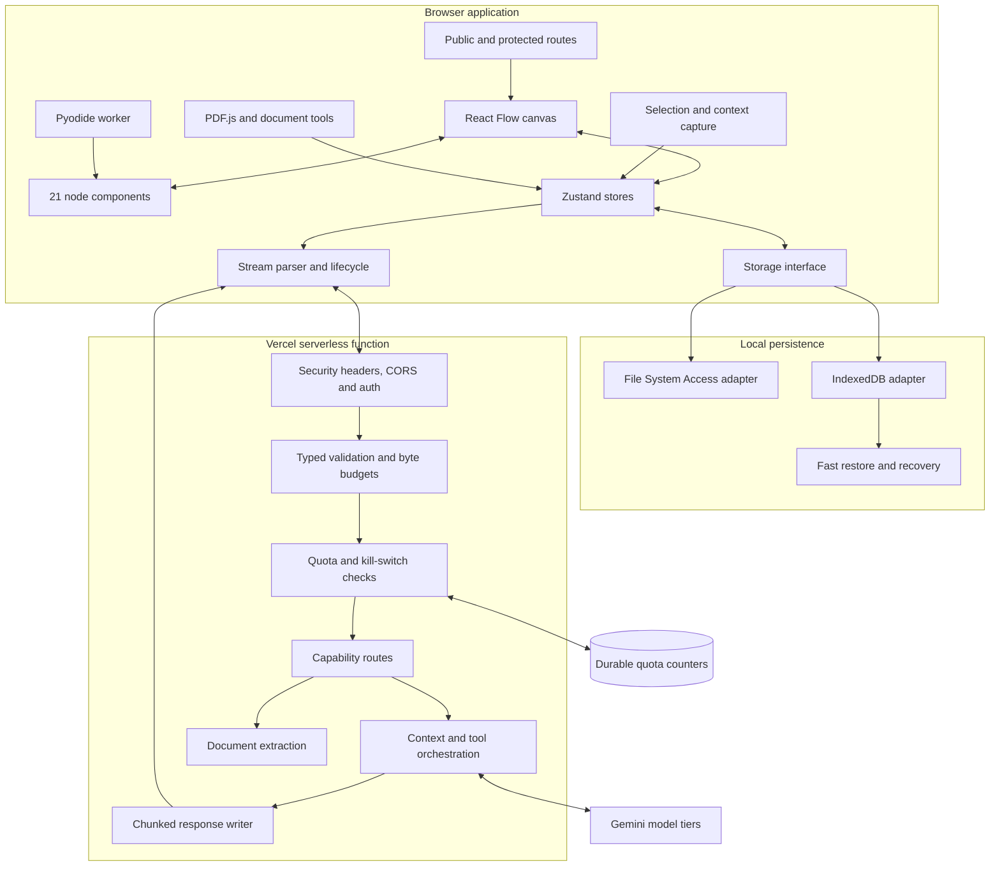
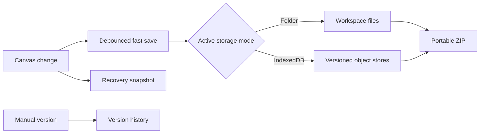
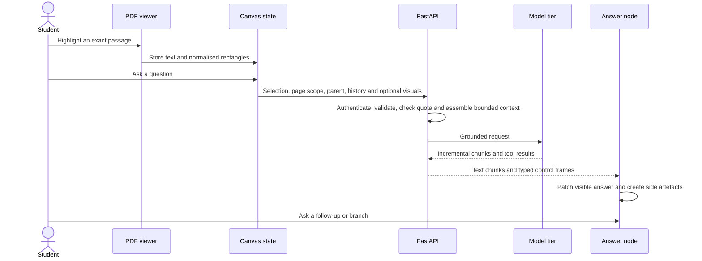
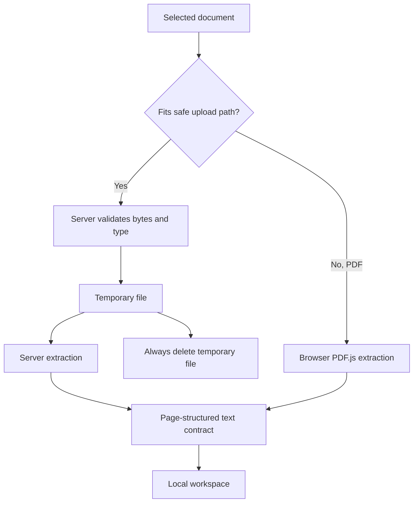
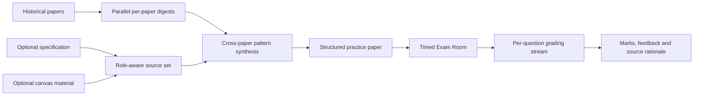

# StudyCanvas architecture

[Back to the project overview](../README.md) · [Decisions](DECISIONS.md) · [Quality](QUALITY.md) · [Privacy and security](PRIVACY-AND-SECURITY.md)

## Purpose and scope

This report explains the production system at a level useful for an engineering review. It covers responsibilities, data flow, failure handling and the constraints that shaped the design. It intentionally omits production source, prompt contents, secret values, invite codes, private model configuration and user material.

The evidence was checked against private revision `f5065d6` on 6 September 2026. StudyCanvas changes quickly, so numbers in this report are snapshots rather than permanent claims.

## Design goals

StudyCanvas is built around five goals:

1. Keep every AI answer visibly connected to the material that caused it.
2. Let one passage branch into several lines of enquiry without becoming a long transcript.
3. Keep workspace data on the student's device at rest.
4. Make expensive model work cancellable, bounded and quota-controlled.
5. Work inside the practical limits of a single serverless deployment.

The main non-goals are multi-user real-time collaboration, semantic retrieval across a large document corpus, remote code execution and server-side document management.

## System context

There are two deployment halves:

- The browser application owns the canvas, document rendering, selection, local persistence, stream rendering and browser-native tools.
- The Python API owns authentication, validation, quota enforcement, temporary document processing, context assembly and calls to paid model services.

The API has no durable user-document database. It receives the context required for an action and returns a result. Uploaded documents can be processed in a temporary file during extraction and are deleted when the request finishes.

## Container view

## Frontend architecture

### Application shell

The React 19 application separates public marketing routes from the protected workspace. Heavy workspace pages are lazy-loaded so the landing page does not eagerly download the canvas, PDF viewer and Python runtime. Vite produces the static application while React Router handles both current and legacy paths.

### Canvas and node model

React Flow provides spatial positioning, view transforms and graph edges. A central registry maps 21 node types to focused components:

- source nodes: primary PDF, secondary PDF and text content
- reasoning nodes: streamed answers, custom assistants and summaries
- assessment nodes: quiz questions, individual flashcards and flashcard stacks
- authoring nodes: rich notes, sticky notes, images, zones and free text
- utility nodes: timer, calculator, LaTeX, Desmos and YouTube
- media nodes: voice notes and transcriptions
- computing nodes: code editor and terminal

The graph is not only visual. An edge can represent provenance, a follow-up branch, a generated study artefact or a code execution relationship. Page state controls which nodes are visible while their persisted records remain intact.

### State boundaries

Zustand stores separate workspace concerns from canvas interaction state. The main boundaries are:

- workspace hierarchy, storage mode and current location
- nodes, edges, pages, viewport and selection
- sessions and authentication
- tutorial, timers, usage and supporting interface state

Transient objects such as abort controllers do not belong in durable snapshots. Saves serialise the stable graph and workspace state, while temporary interaction state is rebuilt on load.

### Selection pipeline

Text selection is captured from eligible surfaces only. PDF highlights are stored with normalised page rectangles so they continue to line up as the page zoom changes. A selection can become a question, note or flashcard, and multiple selected segments can be combined within a defined cap.

The question composer resolves explicitly mentioned nodes and optional attachments before constructing a bounded request. This makes context selection a visible user action rather than a hidden retrieval step.

### Browser Python

Code nodes use CPython compiled to WebAssembly through Pyodide. Execution happens in a worker so long-running snippets do not freeze the canvas. Once the runtime has loaded, the worker removes browser networking and storage globals from the student's execution environment. This reduces the exfiltration surface of generated or pasted code, although it is not described as a perfect security sandbox.

The boundary is deliberate: StudyCanvas can show real output and errors without running untrusted student code on the backend.

## Local-first persistence

The frontend exposes one logical workspace model through two storage adapters.

### Folder mode

On supported Chromium desktop browsers, the student chooses a real directory through the File System Access API. The workspace writes a manifest, canvas states, source documents, secondary PDFs, thumbnails, audio, versions and memory files into that directory.

Advantages:

- the user can see, back up and move the files
- clearing browser data does not delete the workspace itself
- large binary assets do not compete with site storage quotas

Costs:

- the API is not supported consistently across browsers and mobile devices
- permission handles can require renewal
- file writes and migrations need defensive recovery logic

### IndexedDB mode

On Safari, Firefox, iOS, Android and any browser without directory access, the same logical records live in versioned IndexedDB stores. These include the manifest, canvas state, source blobs, thumbnails, memories, versions, exam attempts and specifications.

A fast-restore cache improves reload time and a separate recovery snapshot protects against an interrupted primary save. This mode is more portable but has one important consequence: clearing site data can remove the workspace permanently.

### Portability

ZIP export and import provide a format outside either storage backend. This is also the recovery recommendation for important work stored in IndexedDB.

## Grounded question flow

Context is assembled from separately labelled sections:

1. the student's question
2. the exact highlighted passage
3. nearby page content
4. the direct parent answer for a branch
5. bounded recent conversation plus a rolling summary when required
6. selected node references and workspace memories
7. optional page renders, handwriting, snips or attachments

Each section has an explicit budget. Attachments that would exceed the shared request budget are compressed, reduced or omitted with feedback. The model is asked to treat supplied source material as evidence, but the interface still warns that generated answers can be wrong.

## Streaming protocol and lifecycle

Streaming uses `fetch` and `ReadableStream`. A response carries ordinary display text plus delimited control frames for data such as:

- usage and model reporting
- structured errors
- quiz and flashcard payloads
- generated image data
- optional grounding sources
- rolling conversation summaries

The parser only acts on complete frames, which matters because any marker can be split across network chunks. Display text is rendered immediately while structured artefacts become separate graph nodes.

Every request has a dedicated abort controller. Cancellation, page navigation and component unmount all settle the associated node so it cannot remain in a permanent loading state. Backend failures also arrive through a typed terminal frame where possible.

I chose this protocol because it works through the same HTTP and serverless proxy path as the rest of the application. A typed event stream would provide cleaner framing, but would still need equivalent lifecycle and partial-message handling.

## Document ingestion

### Small and ordinary PDFs

1. The API checks the declared type, filename, actual byte length and PDF magic bytes.
2. It writes the upload to a temporary file.
3. Extraction runs away from the async event loop.
4. Text is normalised into page-delimited output with ligature and encoding repair.
5. The temporary file is deleted in final cleanup, including error paths.

Encrypted, empty and unreadable documents return client-facing errors. Image-only PDFs are valid even when their text layer is empty because the visual path can still inspect rendered pages.

### Large PDFs

Serverless request bodies cannot carry arbitrarily large uploads. Above the safe binary path, the browser uses PDF.js to extract page text locally and sends the smaller structured result. Both paths emit the same per-page contract.

### Office documents

Supported office files are validated and converted to PDF before entering the same extraction flow. Archive-based formats are pre-scanned and size-limited to reduce decompression abuse. Conversion and extraction run off the event loop.

## Model orchestration

Tasks are assigned to model tiers by cost and risk. Short, high-volume work such as titles, OCR and suggestions uses a lightweight tier. Grounded answers, generation and grading use a main tier. A larger opt-in tier is reserved for the custom assistant. Transient failures on lightweight work can retry once on the main tier.

This is static task routing, not a learned complexity classifier. It is predictable, easy to audit and less likely to silently send a difficult question to an unsuitable model. The cost is that routing cannot optimise every individual query.

Optional web grounding is enabled explicitly. It is separate from document grounding and degrades to a normal model answer when unavailable or disabled.

## Exam Forecast

Exam Forecast is a source-grounded practice-paper generator. It is not presented as a guarantee about future exam questions.

The pipeline uses a map-reduce shape:

Historical papers remain the evidence for recurring question patterns. Specification or canvas material can shape coverage without being mislabelled as historical evidence. Inputs are deduplicated by role and capped before the model call.

Each paper is summarised concurrently into a structured digest. A second model call combines those digests into a paper with marks, question types and source rationales. Generation supports past-paper, specification and canvas-led modes. The API retries bounded failures rather than running indefinitely.

Marking streams newline-delimited progress as each question finishes. A final event carries totals. Verifier logic and numeric checks reduce inconsistent verdicts, while failed questions stay unmarked rather than being counted as incorrect.

## Voice and media

Live voice connects the browser to the model provider using a short-lived, single-use token minted by the API. The long-lived provider key never enters the browser. Session duration and daily usage are bounded and recorded against durable quota state.

Voice notes and transcriptions remain canvas artefacts. Audio is stored locally with the workspace. When transcription is requested, the relevant audio is sent for that explicit action.

Image generation, OCR and visual question answering follow the same principle: the user action decides what relevant media leaves the device.

## Backend request path

Every protected request passes through the same layers:

Validation responses and logs remove raw input fields because they can contain study content or encoded media. Quota is charged only when a request reaches paid work. Exact production limits and secret configuration are intentionally omitted here.

## Deployment

One Vercel project serves the static SPA and the Python serverless API under the same domain. Rewrites send API traffic to the FastAPI entry point and all other paths to the application shell.

The platform configuration adds a content security policy, frame denial, MIME sniffing protection and a strict referrer policy. Browser origins are allow-listed. Sessions use bearer tokens rather than cookies, so cross-origin credentials are disabled.

Serverless cold starts and horizontal instances shaped several decisions:

- reusable provider and HTTP clients reduce repeated setup work
- CPU-heavy conversion and extraction move off the async event loop
- durable quota counters replace per-instance-only enforcement
- the backend remains stateless with respect to user workspaces
- client extraction and compression keep request bodies within platform limits

## Failure handling

| Failure | Behaviour |
|---|---|
| Student cancels a stream | Browser aborts the request and preserves readable partial content |
| Navigation makes a request stale | Registered request is cancelled and its node is settled |
| Model fails transiently | Eligible lightweight work retries once on the main tier |
| Durable quota store is unavailable | Expensive paths retain a limited per-instance floor; failure is logged |
| Attachment budget is exceeded | Media is compressed or omitted instead of sending an oversized request |
| PDF is encrypted or unreadable | API returns a clear client error and removes temporary files |
| IndexedDB primary save is corrupt | Recovery snapshot is tried before declaring the canvas unavailable |
| One exam answer fails to grade | Answer stays unmarked and is excluded from totals |

## Current limitations

- No server-side document library means cross-device sync is not automatic.
- No real-time collaboration means local-first state has no conflict-resolution protocol.
- Folder mode is strongest on Chromium desktop; other browsers use IndexedDB.
- Browser Python has a noticeable first-load cost.
- Direct scoped context does not provide corpus-wide semantic retrieval.
- Model grounding and verifier logic reduce error risk but cannot guarantee correctness.
- A private source repository limits independent reproduction from this report.

## Further reading

- [Decision record](DECISIONS.md)
- [Engineering journey](ENGINEERING-JOURNEY.md)
- [Quality and verification](QUALITY.md)
- [Privacy and security](PRIVACY-AND-SECURITY.md)
- [Product walkthrough](PRODUCT-WALKTHROUGH.md)
