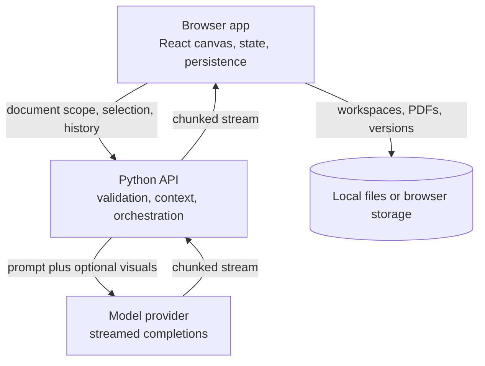

# StudyCanvas architecture

A companion to the showcase `README.md`. It describes how the system fits together at a level that is useful to engineers without publishing implementation details. Endpoint names, request schemas, prompt contents, model identifiers, quotas, rate limits, and infrastructure sizing are intentionally omitted.

## System overview

StudyCanvas is a single domain deployment with two halves:

- a browser app that owns the document view, the canvas graph, selection handling, streaming UI state, and workspace persistence
- a stateless Python API that validates requests, assembles context, calls the model tier, and streams the result back

There is no server side document store and no vector index. The API holds no user documents between requests. The only durable server side state is quota and rate limit bookkeeping.

## Frontend

### Stack

React 19 with TypeScript, built by Vite and styled with Tailwind. The canvas is XYFlow (React Flow). Client state lives in a set of small Zustand stores covering the graph, the workspace, sessions, and peripheral features such as timers and usage tracking. PDF rendering and text extraction reuse PDF.js.

### Node catalogue

The canvas supports a catalogue of node types rather than a single chat transcript. The main ones are the PDF content node, the answer node, quiz and flashcard nodes, summary nodes, a custom assistant node, whiteboard ink, voice notes and transcriptions, code and terminal nodes, calculator, LaTeX and graphing nodes, video embeds, sticky notes, timers, text blocks, and zones. Secondary reference PDFs render with their own styling and page visibility rules.

### Selection pipeline

Text selection is captured globally and filtered before anything is shown. Very short selections are ignored, selection is only accepted from eligible document surfaces, and PDF selections are stored as normalised page rectangles so highlights survive zoom. Multi select appends segments up to a fixed cap. A passing selection raises an ask chip plus note and card shortcuts, and asking opens a question modal with quoted context, node mentions, ghost suggestions, and preset prompts.

### Streaming UI

Each in flight answer is a graph node with explicit loading and streaming flags. Incoming chunks patch the node in place. Every request carries its own abort controller, so navigating pages or cancelling settles the node into readable partial content instead of a stuck spinner. A central registry performs the same settling for summaries interrupted by navigation or unmount.

### Persistence

On startup the app detects a storage mode. Where the File System Access API exists, the workspace is a user visible folder containing a manifest, per canvas state, PDFs, thumbnails, audio, versions, and memory files. Elsewhere the same logical schema is mirrored in IndexedDB, fronted by a debounced fast restore cache and a crash recovery store. Durable saves run on an interval and on navigation or close, with manual versions and session snapshots on top. Whole workspaces move as self contained ZIP files.

## Backend

### Shape

One FastAPI application groups routes by capability: grounded Q&A and assistant chat, study artefacts such as quizzes and flashcards, document ingest, media understanding and generation, layout and memory features, and platform concerns such as auth and signups. A thin serverless entry point exposes the app. There is no database.

### Request handling

Requests pass auth, rate limiting, validation, and quota checks before any model call, and quota is charged only when execution actually reaches the provider. Pydantic models enforce field level length and shape constraints, binary payloads are checked against size and format budgets, and validation failures are scrubbed from logs and responses. Auth is invite gated JWT sessions; the identity feeds quota keys.

### Stateless by design

Every AI request resends what it needs: the document scope, the selection, the parent answer, recent history or a rolling summary, memories, and any visuals. Upload identifiers are fresh per upload rather than lookup keys, because the server cannot render documents on demand in the serverless environment.

## Document pipeline

Uploads are validated by MIME type, magic bytes, and size, written to a temporary file, extracted off the event loop, and then deleted. Extraction has two paths behind one contract: a higher fidelity native path used locally and a pure Python path that fits the serverless bundle. Both emit the same per page delimited structure the frontend splits on.

Both paths share text hygiene such as ligature and encoding repair. Encrypted, empty, and unreadable files are rejected with client errors rather than server errors, and image only PDFs are accepted as valid with empty text. Office documents are converted to PDF first and then flow through the same pipeline. Uploads too large for a serverless body are extracted client side and submitted as structured text through the same cleaning path.

## Context assembly

Each grounded turn is built from bounded pieces: the student question, the exact highlighted passage, the surrounding page scope, the direct parent answer for branches, recent history with a rolling summary for long threads, workspace memories with a defined priority order, explicitly mentioned nodes, and optional visuals such as the page render, whiteboard captures, and attachments. Hard budgets cap every piece, and over budget attachments are dropped with a notice rather than failing the request.

Prompts are assembled server side from delimited blocks with grounding rules that treat the supplied document, selection, visuals, and prior answer as the primary evidence. Quiz and flashcard generation reuse the same grounding with tighter scopes.

## Model tiers

Work is assigned to tiers statically by cost and risk, not by a per query complexity classifier:

- a lightweight tier for cheap tasks such as titles, transcription, OCR, and short summaries, with automatic retry on the main tier for transient provider errors
- a main tier for grounded Q&A, quiz grading, flashcards, and layout
- an opt in larger model for the custom assistant node, gated by effort quotas
- an image tier for generated visuals

Optional web grounding uses the provider search and URL context tools for explicitly web marked turns, and degrades to a plain answer when disabled. Exam forecasting fans out per paper digests on the lightweight tier and fuses them on the main tier.

## Streaming protocol

AI answers stream as chunked plain text rather than server sent events. Display text and control frames share the stream, with in band markers separating usage data, errors, reasoning notes, generated image payloads, quiz and flashcard payloads, grounding sources, and rolling summaries. The client strips the markers, renders the prose incrementally, and spawns side nodes from the artefact frames. Stream failures arrive as in band error frames so the UI can settle the node, and usage is recorded on the final frame.

## Deployment

One hosting project serves the static SPA and the serverless API, with platform rewrites separating API traffic from static traffic. Responses carry hardened headers, cross origin policy is an explicit allow list, and sessions use bearer tokens rather than cookies. Voice uses short lived server minted tokens so the browser connects to the live session directly and the provider key never leaves the server. Serverless constraints on bundle size, request bodies, and durations shaped the dual path extraction, the client side fallback, CPU isolation for document work, and the stateless API.

## Worked example

A highlight to branch flow exercises every layer:

1. Selection in the PDF viewer produces normalised text plus page rectangles.
2. The question modal resolves mentions and the client posts the question with the highlight, the page scope, memories, and any visuals.
3. The API validates, checks quota, assembles the bounded prompt, and streams chunks from the main tier.
4. The client patches the new answer node per chunk and demultiplexes artefact frames into quiz or flashcard nodes linked by edges.
5. A follow up inside that answer reuses the same path with the parent answer attached, or a new selection inside it spawns a child node, growing the tree.

## Deliberate tradeoffs

- Direct scoped context instead of vector retrieval. Grounding is exact and auditable for single document study, at the cost of no corpus wide search.
- Static tier assignment instead of a routing classifier. Cheaper and predictable, at the cost of no per query optimisation.
- Local first storage instead of a server document store. Lower hosting cost and smaller privacy surface, at the cost of browser dependent durability semantics.
- Chunked text with markers instead of events or sockets. Simple to proxy and resume, at the cost of client side parsing.
