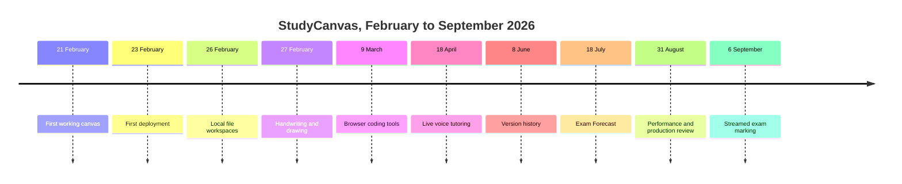

# Engineering journey

[Back to the project overview](../README.md) · [Architecture](ARCHITECTURE.md) · [Decisions](DECISIONS.md)

StudyCanvas did not begin with its current architecture. I built the first version over one weekend, then kept changing the design as the product met real documents, real browser limits and my own revision workflow.

This timeline is reconstructed from the private Git history. Commit identifiers are included as audit references even though the source repository is not public.

## At a glance

## 1. The two-day prototype

**21 to 23 February 2026**

The first version had one useful loop: put a PDF on a canvas, ask questions and turn a page into a quiz. The initial commit was `4b34c9b`; quizzes and flashcards followed on 22 February, and the first deployment landed on 23 February in `9f87838`.

At this point, the architecture was deliberately simple. The document and answers lived in one browser session, model requests were direct, and the product was small enough that component boundaries barely mattered.

What this phase proved was the interaction, not the engineering. Keeping an answer beside the page it explained felt more useful than another chat panel. That justified investing in the canvas model.

## 2. Real documents broke the simple version

**24 to 28 February 2026**

Image-only PDFs, weak text layers, zooming and larger uploads arrived almost immediately. OCR support landed on 24 February. Local rendering and upload fixes followed, then the first local file and folder system on 26 February.

The key change was moving from a temporary browser state to a workspace that had to survive reloads. That introduced persistent identifiers, document blobs, canvas serialisation and migration concerns.

Handwriting and drawing arrived on 27 February. This created a second rendering system on top of the node graph, with its own coordinate transforms and performance constraints. The snipping tool and custom prompts followed on 28 February.

The lesson from this week was simple: document software is mostly edge cases. Encrypted files, scanned pages, changing zoom and interrupted saves mattered more than the happy-path upload.

## 3. The canvas became a workbench

**1 to 25 March 2026**

Voice notes, transcription, custom flashcards and the interactive tutorial arrived at the start of March. On 9 March, StudyCanvas gained document and slide uploads, a code editor, code assistance and a calculator.

Running code created an important boundary decision. I could either build remote execution infrastructure or keep untrusted code off the backend. Pyodide made the second option possible: real CPython runs in a worker inside the student's browser and sends output to a terminal node.

The graph also grew from a collection of answer cards into a typed system. Quiz nodes needed follow-ups. Flashcards needed stacks and multi-page generation. New nodes needed collision-free placement, export behaviour and versioned persistence.

React performance work began here too. Canvas software makes innocent state updates expensive because one change can touch a large visual tree.

## 4. Persistence became product infrastructure

**April to June 2026**

Live voice tutoring took four iterations on 18 April before the complete path worked. Usage tracking and limits shipped with it rather than being postponed. The browser receives a short-lived token, so the permanent provider credential stays on the server.

Persistent user memory arrived on 1 May. Notes, zones, multiple PDFs and canvas version history followed through May and June. By 8 June, both canvas-level and session-level history existed.

These features forced clearer storage boundaries:

- user profile and preferences
- workspace hierarchy
- per-canvas graph state
- source and supporting documents
- binary media such as voice notes and thumbnails
- versions and recovery snapshots
- user, space and canvas memory

Folder mode and IndexedDB mode had to produce the same restored canvas even though their failure modes are different. That is why storage became an interface rather than scattered browser calls.

## 5. Revision workflows, not isolated features

**July 2026**

Spaced repetition shipped on 1 July. Widgets, activity tracking, richer code nodes and more security reviews followed. Exam Forecast began on 18 July.

The first Exam Forecast version proved that historical papers could generate a useful practice session, but one large prompt blurred the role of each source. A past paper, a specification and a student's canvas notes should not count as the same type of evidence.

That weakness later drove the role-aware map-reduce redesign. Each historical paper now becomes its own digest before cross-paper synthesis, while supporting sources shape coverage without pretending to be past-paper evidence.

## 6. Reliability work became visible work

**August 2026**

August was less about adding headline features and more about making existing ones survive awkward timing:

- a PDF viewer opening before dimensions were ready
- a stream being cancelled during page navigation
- summaries finishing after their canvas was gone
- timer alarms surviving reloads
- non-English filenames round-tripping through export
- mathematical content surviving PDF generation
- selection actions racing with layout changes

Focused regression scripts grew around these failures. Instead of one broad test command hiding gaps, the frontend runner discovers every regression script automatically and executes them independently. The backend runner follows the same pattern.

A performance pass at the end of August tackled three different bottlenecks:

- `deb83ab`: handwriting lag and dropped pointer samples
- `112204c`: eager frontend bundles, save work and a hot state selector
- `e54b7ad`: blocking backend file work and repeatedly created clients

These were merged together through `3a7630c`, but they were measured and reviewed as separate changes.

## 7. Making the product explain itself

**31 August to 6 September 2026**

The marketing site was rebuilt around real product proof rather than abstract animation. A compact canvas demo, engineering page, Exam Forecast story, accessible feature explorer and repeatable screenshot harness were added.

The capture workflow itself became an engineering task. React Flow removes off-screen nodes from the DOM, so a DOM count could not prove a saved story canvas was complete. The harness checks persisted IndexedDB state, saves through the application's real shortcut path and uses real mouse movement for PDF text selection.

Exam Forecast received role-aware source modes and deduplication in `9706566`, merged through `1dd53a2`. On 6 September, grading moved to a streamed per-question flow with answer-first checks, verifier logic, numeric checks and explicit unmarked failures.

This public repository is the final part of that work: explaining the system without publishing private source or filling the gaps with claims I cannot support.

## Course corrections

### I did not add vector RAG because it sounded impressive

The original problem is selection-grounded learning inside one active document. Direct context is easier to inspect and cheaper to operate. Retrieval may become useful for multi-document research, but it should arrive with a measured need and visible citations.

### I stopped treating in-memory quotas as enforcement

Serverless instances are short-lived and horizontally scaled. A counter inside one process is not a project budget. Durable counters, project ceilings and kill switches replaced the earlier assumption.

### I kept large PDF extraction out of the normal upload path

The platform rejects oversized request bodies before application code can help. Browser-side extraction became a fallback behind the same page contract rather than pretending the limit did not exist.

### I separated evidence sources in Exam Forecast

Specifications and canvas notes can improve coverage, but they cannot prove a pattern occurred in historical exams. Source roles and deduplication now preserve that distinction.

### I replaced fixed handwriting smoothing

Fixed smoothing reduced jitter but made quick strokes trail the pointer. A speed-adaptive one-euro filter and incremental wet-stroke layer addressed the actual perception problem.

### I removed unsupported marketing numbers

An older description claimed a percentage reduction from model routing without a traceable benchmark. The claim was dropped. Current reports use dated counts, test outputs and narrow implementation facts instead.

## What I would do differently now

If I restarted the project with the same knowledge, I would:

1. define the storage interface before the first durable workspace
2. version the streaming control protocol from its first structured artefact
3. build the auto-discovering regression runners earlier
4. separate source roles before the first multi-document AI workflow
5. record benchmark methods beside each performance change, not only the result
6. keep public architecture notes current from the start

I would still begin with the small PDF-to-question loop. It answered the only question that mattered at the start: whether spatial, source-visible learning was actually useful.

## Current snapshot

As at private revision `f5065d6`, dated 6 September 2026:

- 398 commits since 21 February 2026
- 103,565 source lines across 434 source files
- 21 registered canvas node types
- 22 backend capability route modules
- 46 passing focused frontend regression scripts
- 9 passing focused backend regression scripts

The counts will age. The decisions and the reasons behind them are the lasting part of the record.
