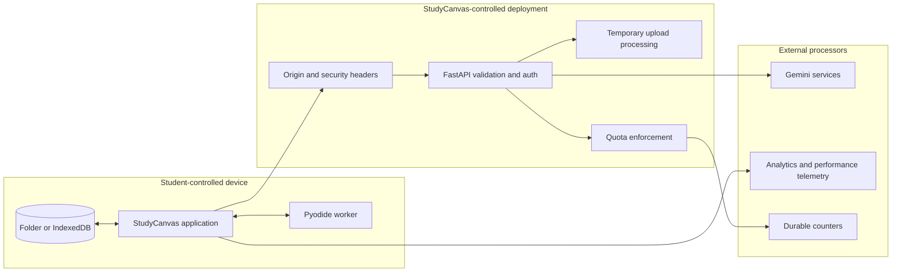

# Privacy and security architecture

[Back to the project overview](../README.md) · [Architecture](ARCHITECTURE.md) · [Quality](QUALITY.md) · [Vulnerability reporting](../SECURITY.md)

## Scope

This document explains the technical boundaries around student data, paid model access and untrusted content. It is an architecture report, not a replacement for the live [Privacy Policy](https://studycanvas.app/privacy) or [Terms](https://studycanvas.app/terms).

The central rule is local-first, not device-only. Workspace data is stored locally at rest, but an explicit upload or AI action can send the relevant content to the StudyCanvas API and its model provider.

## Data lifecycle

| Data | Stored at rest | Leaves the device when | Server behaviour |
|---|---|---|---|
| Canvas graph and notes | Chosen folder or IndexedDB | Relevant excerpts are included in an explicit AI request | No server-side canvas store |
| Primary and supporting documents | Chosen folder or IndexedDB | Initial extraction, or when a relevant page or attachment is used by an AI feature | Upload is processed in a temporary file and deleted after extraction |
| Highlighted text and page context | Local workspace | Student asks a grounded question, quiz or generation request | Used to assemble that request; not kept as a document library |
| Images and handwriting | Local workspace | Student invokes visual understanding, OCR, generation or attaches the image | Validated and sent only for that action |
| Voice-note audio | Chosen folder or IndexedDB | Student requests transcription | Sent for transcription and returned as text |
| Live voice audio | Live browser session | Student starts live voice mode | Browser connects with a short-lived token; permanent provider key stays server-side |
| Exam papers and answers | Local workspace | Student generates or grades an exam | Relevant source and answer content is sent for that action |
| Waitlist details | Service-side waitlist flow | Student submits the form | Email and request metadata are used for access administration |
| Usage counters | Durable quota store | A protected paid action is attempted | Stores metering keys and counters, not document bodies |
| Product analytics | Analytics provider | Student visits the site | Aggregate product and performance telemetry is collected according to the live policy |

There is no background document synchronisation. An AI action is the boundary that moves selected study content from the local workspace into a model request.

## Trust boundaries

The browser, application deployment and external providers are separate trust zones. Local-first storage reduces the amount of durable application-side data, but it does not make an AI request end-to-end encrypted from the model provider.

## Authentication

StudyCanvas is invite-gated. A valid invite flow creates a signed bearer session. Protected API routes reject missing, invalid or expired sessions. The browser attaches the bearer token to API requests and clears the local session when the server returns an authentication failure.

Sessions are not stored in cookies, so cross-origin credential sharing is disabled. The production secret, accepted invite material and exact signing configuration are deliberately not published here.

## Input validation

The API validates untrusted data before model or conversion work:

- Pydantic schemas bound field lengths, list sizes and accepted values.
- Binary inputs are checked for declared type, magic bytes, decoded size and total request budget.
- Archive-based office formats are pre-scanned before conversion.
- PDF processing caps pages and extracted text volume.
- Rich-text and URL outputs are sanitised before rendering in the browser.
- Validation logs and client errors remove raw input values that might contain study material or encoded images.

Validation is performed before paid work where practical. Clean client errors are preferred to provider calls with malformed or oversized content.

## Temporary document processing

Normal document upload follows a short-lived pipeline:

1. validate metadata and bytes
2. write a temporary file
3. extract page-structured content away from the async event loop
4. return the result
5. delete the temporary file in final cleanup

If a PDF is too large for the safe serverless upload path, PDF.js extracts text in the browser and sends the smaller page structure instead. This reduces server exposure for that path, but it does not mean every document is always processed locally.

## Model access and cost abuse

The backend owns paid provider credentials. They are never shipped in the frontend bundle.

Protected model routes combine several controls:

- invite-gated bearer authentication
- per-IP rate limits
- durable per-user quotas
- a project-wide emergency ceiling
- feature-level kill switches
- bounded output and attachment budgets
- limited per-instance fallbacks for the most expensive paths if durable quota storage fails

Quota is charged when execution reaches paid work, not for a request that fails early validation.

### Public product demo

The landing-page demo is intentionally narrower than the signed-in product. It accepts a fixed subject identifier and a bounded question. The supporting passage is selected on the server, so the endpoint cannot be used as a general prompt proxy. Origin checks, per-address limits, a global daily ceiling, an output cap and a kill switch bound the remaining abuse surface.

Exact thresholds are operational details and are not copied into this report.

## Browser code execution

Python code runs through Pyodide in a Web Worker rather than on StudyCanvas servers. After the runtime starts, browser network and storage globals are removed from the student's code environment. This reduces the chance that generated code can read local browser data or make network requests.

This is a useful isolation boundary, not a formal claim that a complex browser runtime is vulnerability-free. Resource-heavy code can still consume the student's local CPU and memory, so execution remains explicit and cancellable.

## Live voice

The permanent model credential stays on the server. When a student starts live voice, the backend validates the session and quota before minting a single-use, short-lived token. The browser then connects directly for the live session. Session time is bounded and usage is reported to durable quota state.

This avoids proxying a continuous audio stream through the application server while keeping the reusable provider credential out of the browser.

## Web and URL safety

Web grounding is opt-in for supported assistant actions. It is separate from document grounding and can be disabled operationally. Rendered links and rich content pass through sanitisation so dangerous URL schemes and unsafe attributes do not become active content on an imported or generated canvas.

Embedded services are constrained by the site's content security policy and provider allow-list. The site also denies framing, disables MIME sniffing and uses a strict referrer policy.

## Secrets and repository separation

The public repository must never contain:

- environment files or secret values
- model, email, KV or signing credentials
- invite codes
- session tokens
- private source prompts
- real user PDFs, notes, images or audio
- local absolute paths from the development machine

The production source and deployment configuration remain in a private repository. This public report uses architecture-level descriptions and sanitised product captures only.

## Threat summary

| Threat | Main controls | Residual risk |
|---|---|---|
| Unauthorised paid-model use | Auth, quotas, rate limits, project ceiling and kill switches | Distributed abuse and provider cost cannot be reduced to zero |
| Oversized or malformed files | Type, magic-byte, archive and size validation; page and text caps | Complex parsers can still contain unknown vulnerabilities |
| Sensitive content in logs | Raw validation input is removed from logs and error responses | Downstream providers still receive content needed for explicit AI actions |
| Browser credential theft | Provider secrets stay server-side; voice uses short-lived tokens | A compromised device or browser session remains outside application control |
| Generated unsafe links or markup | Rich-text and URL sanitisation plus CSP | Sanitisation requires maintenance as supported content grows |
| Lost local workspace | Folder mode, ZIP export, versions and recovery snapshots | IndexedDB can be erased if the user clears site data without an export |
| Untrusted Python code | Browser worker, removed network and storage globals, no backend execution | Local CPU or memory exhaustion is still possible |
| Cross-origin API calls | Exact origin allow-list, no credentialed CORS and bearer auth | A stolen valid bearer token can be used until expiry |

## Honest limits

- StudyCanvas does not provide end-to-end encryption between the browser and external AI provider.
- Local-first does not mean that explicit AI requests remain on the device.
- There is no published independent penetration test for the product.
- Client-side isolation cannot protect against a compromised browser or operating system.
- Provider processing and retention are governed by the applicable provider terms and the live product policy.
- Security controls reduce risk; they do not prove the absence of vulnerabilities.

## Reporting a vulnerability

Please do not open a public issue for a suspected vulnerability. Follow the private contact process in [SECURITY.md](../SECURITY.md) so there is time to investigate before details are disclosed.
