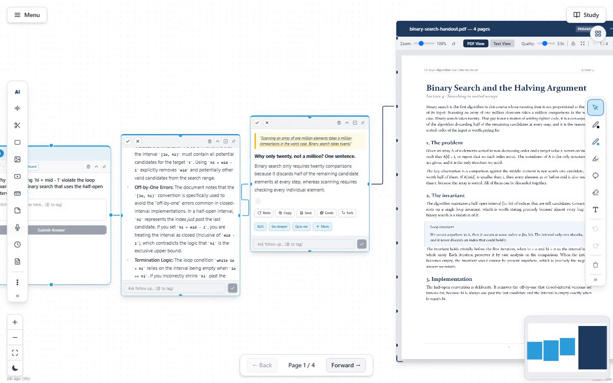
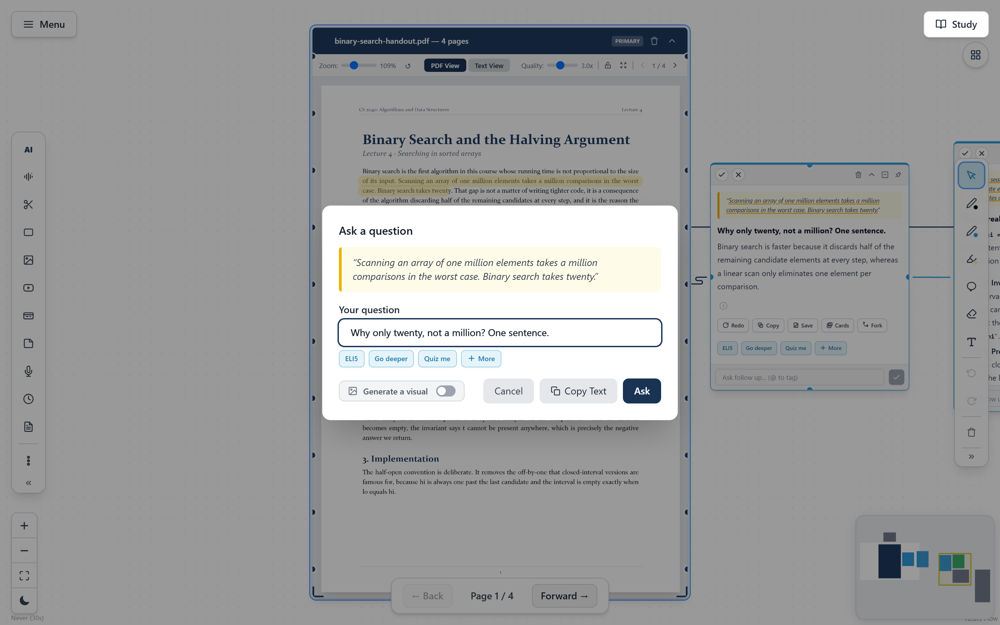
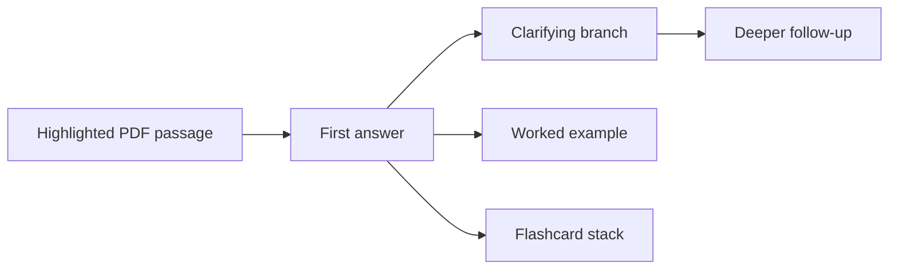
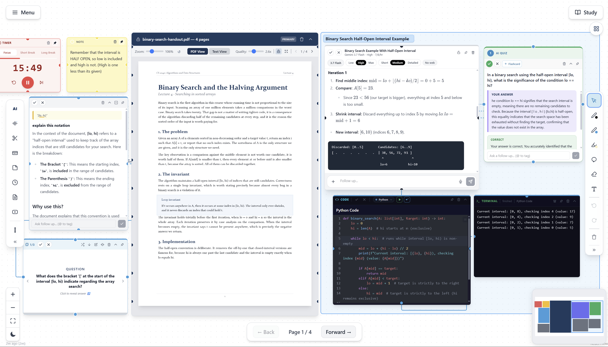
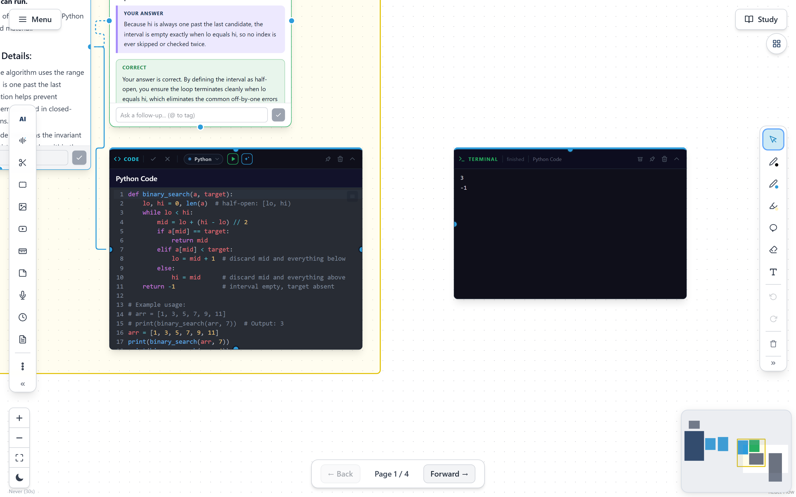
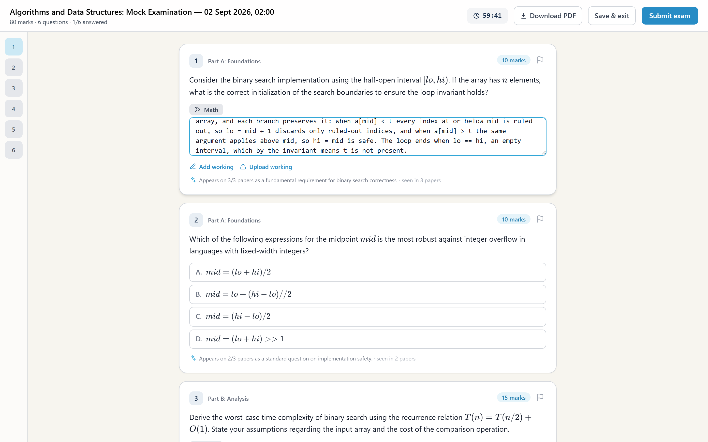

# Product walkthrough

[Back to the project overview](../README.md) · [Architecture](ARCHITECTURE.md) · [Engineering decisions](DECISIONS.md)

This walkthrough follows one realistic StudyCanvas session. Every image is a capture from the working product.

## 1. Start with the source, not an empty chat

The primary PDF lives directly on the canvas. The student can read it, move between pages, switch view modes, draw on it and keep related material nearby.

The important design choice is that the source never becomes a hidden attachment. It remains a first-class node while the learning trail grows around it.

## 2. Select the exact claim that needs explaining

The student highlights a sentence and asks a focused question. The composer shows the selected quotation before the request is sent.

The request carries the selection, surrounding page scope and any explicitly referenced nodes or visuals. The answer is therefore grounded in visible context rather than an invisible whole-document search.

[Watch the short highlight-to-answer capture](../assets/product/highlight-to-answer.mp4).

## 3. Let the answer become part of the canvas

The answer streams into a new node connected to the PDF. It keeps the source quote at the top and exposes actions to copy, save, make cards, retry or fork the reasoning.

A follow-up can stay inside the answer node as a compact thread. A selected phrase can instead create a child node, which is useful when one explanation opens several separate questions.

The graph edge is both visual and semantic: it records what caused the new artefact.

## 4. Turn understanding into active recall

Any relevant page, selection or answer can become a quiz or flashcard set. Generated study tools appear as their own nodes, which means the student can rearrange, group, revisit and connect them instead of losing them in model prose.

Quiz answers can receive feedback and follow-up questions. Flashcards can be grouped into stacks and scheduled through spaced repetition. Notes saved from an answer preserve rich text and maths while becoming editable student-owned content.

## 5. Move from explanation to executable code

For programming material, a code node can sit beside the concept it demonstrates. Running it starts CPython through Pyodide in a browser worker and sends output to a terminal node.

This is a real execution path, not a syntax-highlighted example. Keeping it in the browser avoids a backend remote-code-execution service and lets the explanation, code, result and correction stay connected on the same page.

## 6. Organise without erasing provenance

As a canvas grows, the student can create zones, group topics, search across nodes and ask the organiser to tidy the layout. The organiser receives bounded node summaries rather than raw visual pixels, then the client applies collision-aware positions.

Manual movement always remains available. Organisation changes placement, not the source relationships recorded by edges.

Version snapshots provide a return path if an experiment or automatic layout is not useful. Whole workspaces can also be exported as portable ZIP files.

## 7. Generate a source-grounded practice paper

Exam Forecast accepts historical papers and optional supporting sources. It summarises each historical paper separately, finds recurring patterns across those summaries, then creates a fresh practice paper.

The source roles stay explicit:

- past papers provide historical pattern evidence
- a specification can constrain coverage
- canvas material can focus the paper on what the student has studied

Supporting material is not counted as proof that a topic occurred in previous examinations.

## 8. Sit the paper in the Exam Room

The generated paper opens in a focused full-screen environment with timing, marks, question navigation, typed answers and uploaded working.

When submitted, marking streams one question at a time. The interface can show progress instead of waiting for one long blocking result. Verifier logic checks verdict consistency, and any grading failure remains unmarked and outside the total rather than silently becoming a zero.

Exam Forecast is a structured revision tool. It is not claimed to predict a future paper with measured accuracy.

## 9. Leave with a workspace, not a transcript

At the end of the session, the student has:

- the original sources
- a visible tree of questions and answers
- editable notes
- quizzes and spaced-repetition cards
- executable examples and output
- handwriting and working
- an exam attempt with feedback
- version history and an exportable workspace

That collection is the product idea in one sentence: StudyCanvas keeps the material, the reasoning and the revision loop together.

## Where each part runs

| Action | Browser | StudyCanvas API | Model provider |
|---|---|---|---|
| Read, move, draw and save | Yes | No | No |
| Run Python | Yes, in a worker | No | No |
| Extract an oversized PDF's text | Yes, with PDF.js | Receives structured text | No |
| Extract an ordinary uploaded document | Sends upload | Temporary extraction | No |
| Ask, quiz, summarise or generate | Builds scoped request | Validates, meters and streams | Processes the explicit request |
| Start live voice | Runs session UI | Mints short-lived token | Handles the live model session |
| Export workspace | Builds archive | No | No |

For the deeper system view, continue to the [architecture report](ARCHITECTURE.md).
